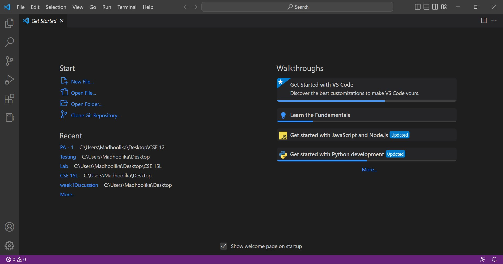
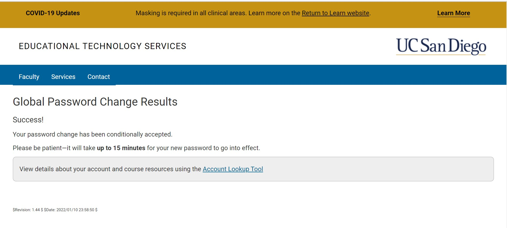
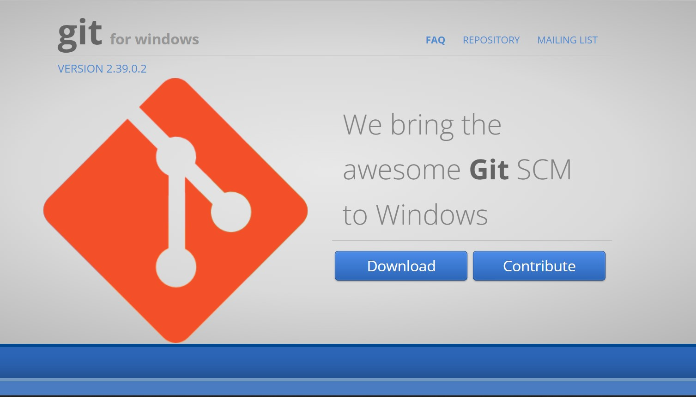
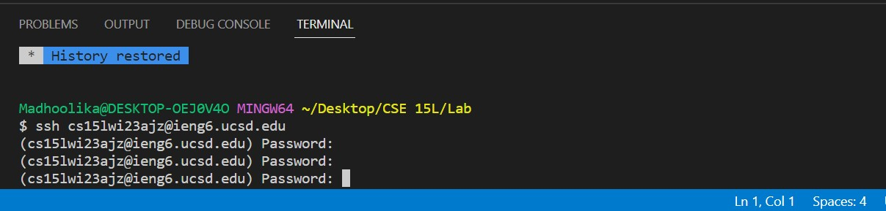
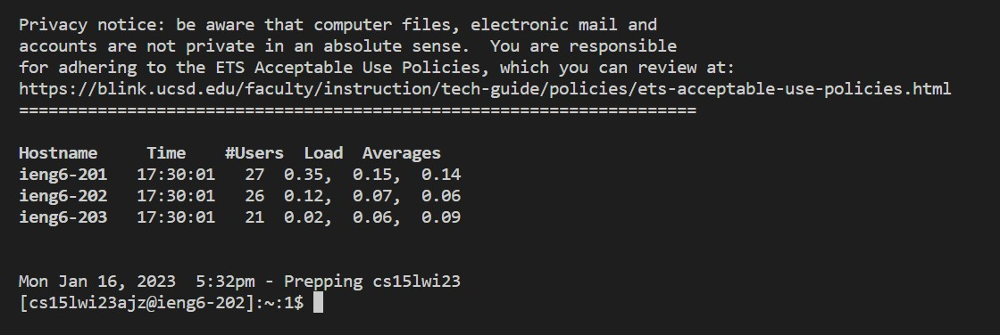
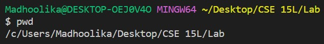
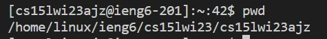
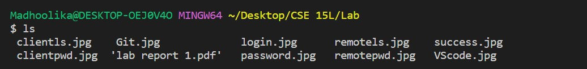

# **Working our way to remote access - CSE 15L**
## **Task 1 -Installing Visual Studio Code (VScode)**
VS code is an IDE (Integrated DevelopmentEnvironment) we will be using for our class. So evidently, our first task is to install and set up VScode.
Click on the following link that will take you to the official [VScode website](https://code.visualstudio.com/). Select the most latest version of VScode that suits your OS and install it on to your computer. 
In case you are hesitant to download VScode and other imporant files onto your personal computer, you could use UCSD's lab computers - you'll find them at the basement of CSE building.
After it is done, open it up and you'll find a window looking like such: 

**NOTE:** You will not be able to see the Recent files (like in the picture above) when you install VScode afresh as you have not yet opened/created files using VS Code.

## **Task 2 - Remotely connecting**

For you to connect to the remote server from your computer, you'll need to activate your course-specific account.

**Task 2.1** - Activating your CSE 15L account

Follow [this link](https://sdacs.ucsd.edu/~icc/index.php) that will take you to UCSD's IT sercives website, and follow the steps below.
  1. Select the account that starts with 'cs'. It will look something like cs15lfa22zz.
  2. Enter your current password and then enter the new password you'd like the CSE 15L account to have.
  3. Select *No* for the question - 'Change MyTritonLink password?'
  4. Instead of clicking on 'Check' that appears at the end of the page, just press enter on your keyboard.
  5. Wait for about 15 mins for UCSD's system to reset your password
  You will know if you have successfully changed your password if you see the following on the website.
  
  
**Task 2.2 - Accessing the account**
Closely follow the steps below to connect to the remote server:

1. Download Git using this [this link](https://gitforwindows.org/) 
2. Go onto VScode and type *ctrl + shift + p*
3. Type 'Select Default Profile' onto the search bar and select select Git Bash
4. Open VScode terminal or just press *ctrl + `*
5. Type in ssh cs15lwi23XXX@ieng6.ucsd.edu, but replace'XXX' with your username. 
   For example, if your username is cs15lfa22abc, replace 'XXX' with 'abc'
6. When the computer prompts you for the password, type your password that you recently set, and press *enter*

**NOTE:** If you are having troubles with logging in, and your terminal looks something similar to below, please wait for a while longer and retry
          (UCSD's servers might be in the process of resetting your passsword). Make sure you are typing in the correct password.
          

7. After successfully logging in, your terminal will look something like below:

8. Try out some commands to see how they work differently from the client computer and the remote server.
   eg: cd ~, cd, ls -lat, ls -a
   
   Below are some of the differences between excecuting the above commands on a client computer vs remote server:
   
   **pwd** - It prints the working directory you are in. Client and remote dierectories should be different because you are accessing different locations.
   
   This is my Client pwd
   
   
    
   
   This is my Remote pwd
   
   
   
   
   **ls** - Lists out all the files in the current directory. The folder I have opened has a few pictures in them hence you can see a lot them in my list.
   My remote server has two java folders and hence you can see them in the list of files on the remote server.
   
   This is my Client ls
   
   
    
   
   This is my Remote ls!
   
   
   [Remote ls](remotels.jpg)
   
   
   
   

